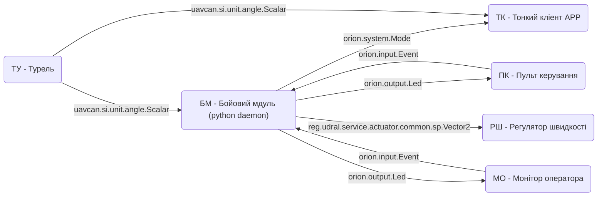
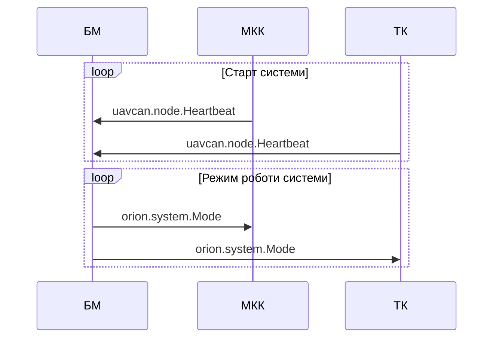
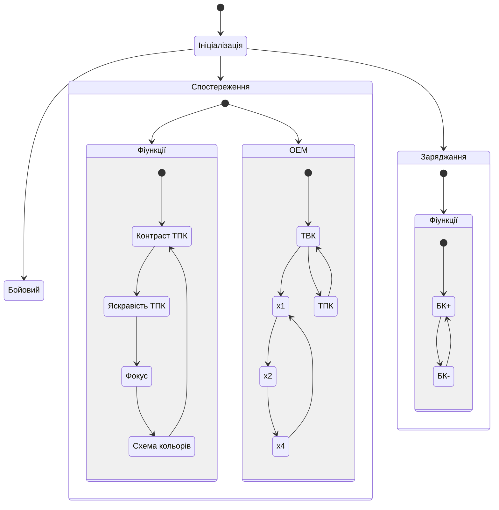

# Базова схема програмного модуля

## Перелік прийнятих умовних позначень та скорочень

* БМ - Бойовий мдуль (python daemon)
* ПК - Пульт керування
* МО - Монітор оператора
* РШ - Регулятор швидкості ESC
* ТК - Тонкий кліент APP
* ТУ - Турель (енкодери положення)

## Взаємодія модулів по шині CAN - DSDL

## Запуск системи

## БМ - Бойовий мдуль / *State machine*

